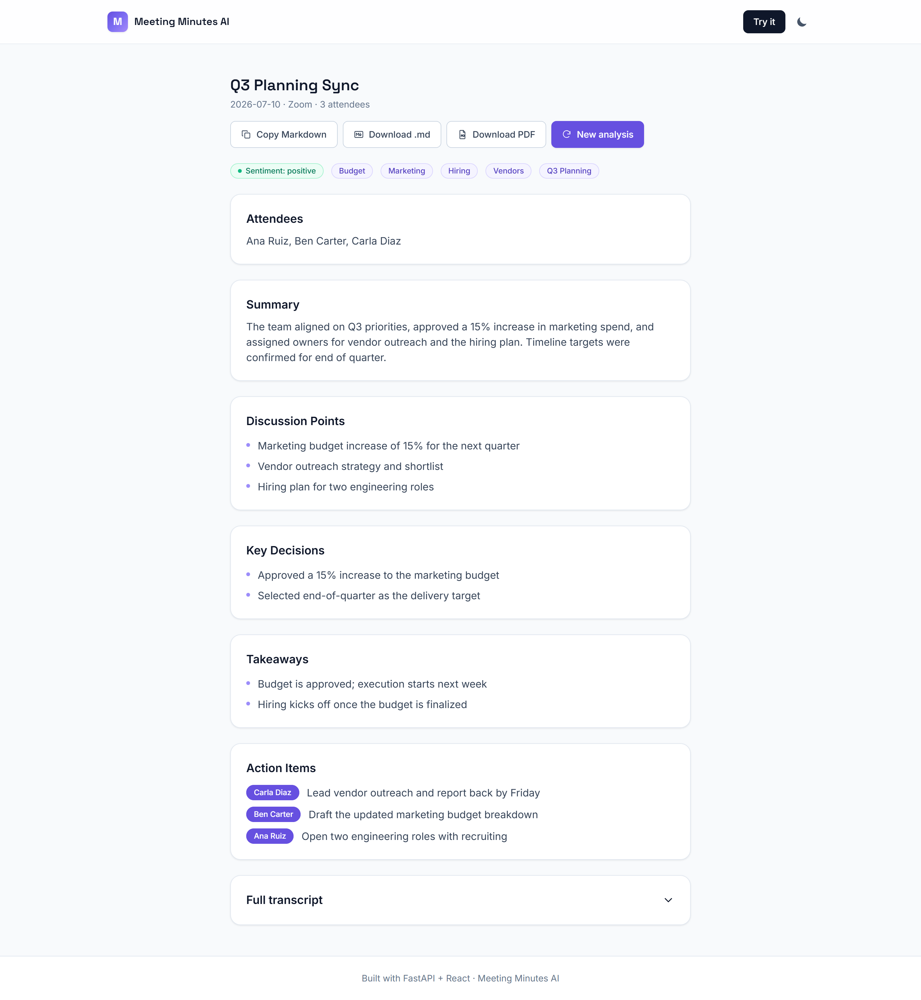
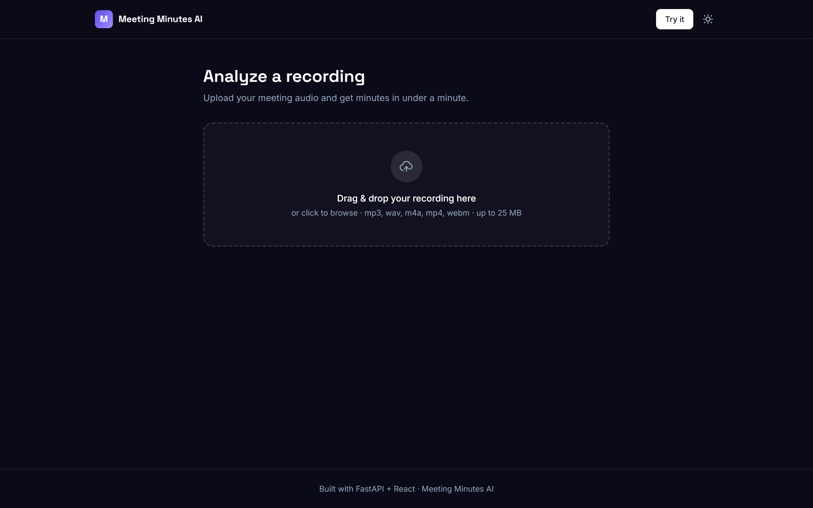

# Meeting Minutes AI

Turn any meeting recording into clear, structured minutes — summary, discussion
points, key decisions, takeaways, and action items with owners — plus quick
insights on sentiment and topics. Upload an audio file, get shareable minutes
in under a minute, and export them as Markdown or PDF.

> Built with **FastAPI + React (Vite + TypeScript + Tailwind)**, served as a
> single Docker container and deployed to **Railway**. The AI provider is
> swappable between **OpenAI** and **OpenRouter** via one env var — it drives
> both transcription and minutes generation, so the whole pipeline can run on
> a single provider and key. The app is stateless — no database, no accounts,
> nothing persisted server-side.

## Screenshots

| Homepage | Analysis results |
|---|---|
|  |  |

<details>
<summary>Dark mode</summary>

| Homepage (dark) | Upload screen (dark) |
|---|---|
|  |  |

</details>

## Features

- **Audio transcription** — OpenAI or OpenRouter (e.g. `openai/whisper-1`)
- **Structured minutes** — summary, discussion points, key decisions, takeaways
- **Action items with owners** — extracted automatically from the discussion
- **Extra insights** — overall sentiment and key topics for the meeting
- **Export options** — copy as Markdown, download `.md`, or download/print as PDF
- **Swappable provider** — one env var points transcription *and* generation at OpenAI or OpenRouter
- **Light/dark mode** — toggle in the navbar, preference persisted across visits
- **Polished feature-showcase homepage** and a focused upload/analyze flow
- **Stateless** — no database, no auth; nothing about your meeting is stored server-side

## Tech Stack

| Layer     | Tech |
|-----------|------|
| Frontend  | Vite, React 18, TypeScript, Tailwind CSS, React Router, react-markdown |
| Backend   | FastAPI, Uvicorn, Pydantic / pydantic-settings, OpenAI SDK |
| AI        | OpenAI or OpenRouter — one provider drives transcription + minutes generation |
| Testing   | pytest + httpx (backend), AI calls mocked |
| Deploy    | Multi-stage Dockerfile, Railway (single service) |

## Architecture

The frontend builds to static files that FastAPI serves directly, so the
whole app runs as **one service** with **one public URL** — no separate
frontend host, no CORS to configure.

```
                       ┌───────────────────────────────────────────┐
                       │              FastAPI service                │
  Browser (React SPA)  │                                             │
  ───────POST /api/analyze──▶  validate file (type, size)            │
        (audio file)   │        │                                    │
                       │        ▼                                    │
                       │  transcribe()  ──▶ OpenAI or OpenRouter      │
                       │        │            audio API → transcript   │
                       │        ▼                                    │
                       │  analyze()     ──▶ OpenAI or OpenRouter      │
                       │                     chat API → JSON minutes  │
                       │        │                                    │
  ◀──────structured minutes + insights──────┘                        │
                       │                                             │
  GET /  GET /*        │  serves built React SPA (frontend/dist)     │
                       │  GET /api/health → {"status":"ok"}          │
                       └───────────────────────────────────────────┘
```

## Local Development

### 1. Backend

```bash
python -m pip install -r backend/requirements.txt
cp .env.example backend/.env    # fill in OPENAI_API_KEY (and OPENROUTER_API_KEY if needed)
cd backend
python -m uvicorn app.main:app --reload --port 8000
```

### 2. Frontend

```bash
cd frontend
npm install
npm run dev
```

Open http://localhost:5173 — the Vite dev server proxies `/api` requests to
the backend on port 8000.

### Run tests

```bash
cd backend
python -m pytest -q
```

AI calls (transcription + generation) are mocked in tests, so no API key is
required to run the suite.

## Environment Variables

Copy `.env.example` and fill in the values you need:

| Variable | Default | Purpose |
|----------|---------|---------|
| `LLM_PROVIDER` | `openai` | Provider for **both** transcription and generation: `openai` or `openrouter` |
| `OPENAI_API_KEY` | — | Required when `LLM_PROVIDER=openai` |
| `OPENROUTER_API_KEY` | — | Required when `LLM_PROVIDER=openrouter` |
| `GENERATION_MODEL` | `gpt-4o-mini` | Chat model that writes the minutes (e.g. `gpt-4o-mini` for OpenAI, `openai/gpt-4o-mini` or `meta-llama/llama-3.3-70b-instruct` for OpenRouter) |
| `TRANSCRIPTION_MODEL` | `gpt-4o-mini-transcribe` | Audio model, matched to the provider (e.g. `whisper-1` on OpenAI, `openai/whisper-1` on OpenRouter) |
| `MAX_UPLOAD_MB` | `25` | Maximum upload size in MB (OpenAI's hard limit is 25) |

## Deploy to Railway

1. Push this repo to GitHub.
2. In Railway: **New Project → Deploy from GitHub repo**.
3. Railway builds the multi-stage `Dockerfile` (build the React app, then
   copy the static output into the Python runtime image) as configured in
   `railway.json`.
4. Add environment variables in the Railway dashboard: `OPENAI_API_KEY` at
   minimum, plus `LLM_PROVIDER` and `OPENROUTER_API_KEY` if you want to use
   OpenRouter for generation.
5. Deploy. Railway injects `$PORT`, the container's `CMD` binds Uvicorn to
   it, and `/api/health` is used as the healthcheck endpoint. The container
   also runs as a non-root user for a hardened deploy.

## Switching to OpenRouter

By default the app uses OpenAI. `LLM_PROVIDER` switches **both** transcription
and generation to OpenRouter — which now exposes an OpenAI-compatible
`/audio/transcriptions` endpoint — so you can run the whole pipeline on
OpenRouter with a single key and no OpenAI account:

```
LLM_PROVIDER=openrouter
OPENROUTER_API_KEY=your-openrouter-key
GENERATION_MODEL=openai/gpt-4o-mini     # any OpenRouter chat model id
TRANSCRIPTION_MODEL=openai/whisper-1    # or openai/whisper-large-v3
```

Both transcription and generation go through the same OpenAI SDK, just pointed
at `https://openrouter.ai/api/v1` with OpenRouter model slugs. (Want to keep
transcription on OpenAI while generating on OpenRouter, or vice versa? That's a
small change to `get_transcription_client()` in `backend/app/llm.py`, which is
where the provider for transcription is chosen.)

## Project Structure

```
backend/
  app/
    main.py       FastAPI app, /api/analyze and /api/health routes, SPA serving
    analyzer.py    transcribe() + analyze() orchestration
    llm.py         provider clients (OpenAI / OpenRouter)
    config.py      pydantic-settings env var config
    schemas.py     Minutes / ActionItem / Sentiment / AnalyzeResponse models
  tests/           pytest suite (AI calls mocked)
frontend/
  src/
    pages/         Home (feature showcase), Analyze (upload + results)
    components/     Navbar (incl. dark mode toggle), UploadZone, Results
    lib/            api client, Markdown/PDF export helpers
    types.ts        TypeScript types mirroring backend schemas
Dockerfile          multi-stage build: Vite build -> Python runtime, non-root user
railway.json        Railway build/deploy config + healthcheck
python.py           original Colab script this project grew from
```

## Origin

This project started as a Colab script (`python.py`, still in the repo) that
transcribed audio with OpenAI and generated minutes on a local GPU-hosted
Llama model. This repo rebuilds that idea as a real product: minutes
generation moved to a cloud API (so it runs anywhere, no GPU needed), and it
gained a full web UI, sentiment/topic insights, Markdown/PDF export, dark
mode, and a one-service Docker deploy on Railway.
