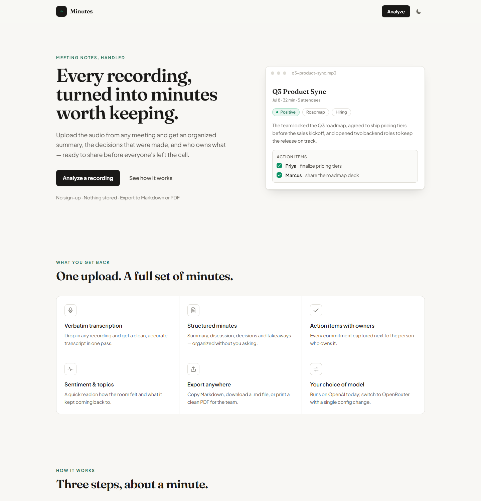
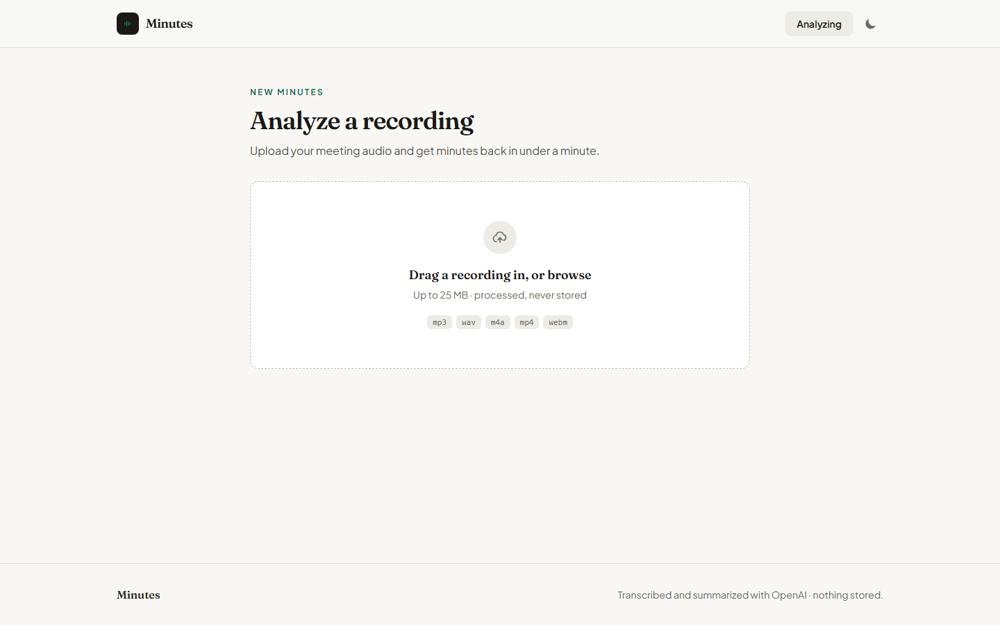
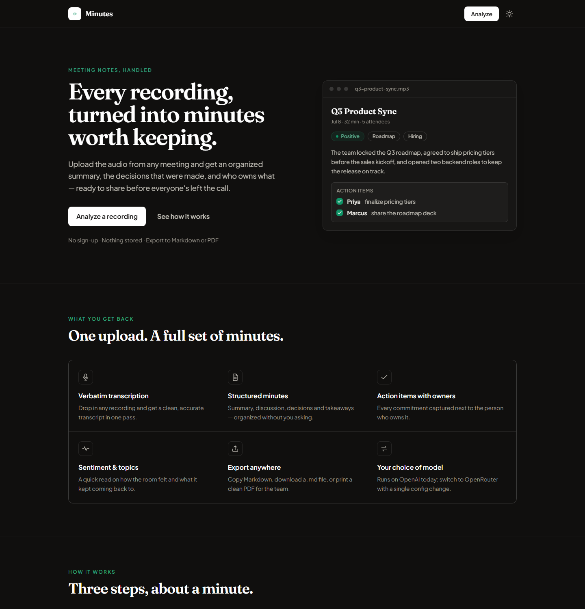

# Meeting Minutes AI

Upload a meeting recording and get back clean, structured minutes — a summary,
the decisions that were made, action items with owners, and a quick read on
sentiment and topics. You can copy the result as Markdown or save it as a PDF.

It's a single FastAPI service: the React frontend builds to static files that
FastAPI serves alongside the `/api` routes, so the whole thing runs as one
container on Railway. There's no database and no login — nothing about your
meeting is stored.



<details>
<summary>Upload screen and dark mode</summary>




</details>

## Running it locally

You'll need two terminals — one for the API, one for the frontend.

**Backend:**

```bash
python -m pip install -r backend/requirements.txt
cp .env.example backend/.env      # then add your API key
cd backend
python -m uvicorn app.main:app --reload --port 8000
```

**Frontend:**

```bash
cd frontend
npm install
npm run dev
```

Open http://localhost:5173. The dev server proxies `/api` to the backend on
port 8000, so uploads work without any CORS setup.

To run the tests (AI calls are mocked, so no key needed):

```bash
cd backend && python -m pytest -q
```

## Configuration

Everything is set through environment variables. Copy `.env.example` to
`backend/.env` and fill in what you need:

| Variable | Default | What it's for |
|----------|---------|---------------|
| `LLM_PROVIDER` | `openai` | Which provider to use — `openai` or `openrouter`. Drives both transcription and generation. |
| `OPENAI_API_KEY` | — | Needed when `LLM_PROVIDER=openai`. |
| `OPENROUTER_API_KEY` | — | Needed when `LLM_PROVIDER=openrouter`. |
| `GENERATION_MODEL` | `gpt-4o-mini` | The chat model that writes the minutes. |
| `TRANSCRIPTION_MODEL` | `gpt-4o-mini-transcribe` | The model that transcribes the audio. |
| `MAX_UPLOAD_MB` | `25` | Upload size limit (OpenAI caps audio at 25 MB). |

The provider is just the OpenAI SDK pointed at a different base URL, so
switching to OpenRouter is only a config change. To run the whole pipeline on
OpenRouter with one key:

```
LLM_PROVIDER=openrouter
OPENROUTER_API_KEY=your-key
GENERATION_MODEL=openai/gpt-4o-mini
TRANSCRIPTION_MODEL=openai/whisper-1
```

## Deploying to Railway

1. Push the repo to GitHub.
2. In Railway, create a new project from the GitHub repo. It picks up the
   `Dockerfile` automatically (via `railway.json`), builds the frontend, and
   copies the static output into the Python image.
3. Add your environment variables in the Railway dashboard.
4. Deploy. Railway sets `$PORT`, the container binds Uvicorn to it, and
   `/api/health` is used for the health check.

Every push to the main branch redeploys.

## How it's put together

```
backend/
  app/
    main.py       FastAPI routes (/api/analyze, /api/health) + serves the SPA
    analyzer.py   transcribe() then analyze() into structured minutes
    llm.py        picks the OpenAI or OpenRouter client
    config.py     env-var settings
    schemas.py    the response models
  tests/          pytest, with the AI calls mocked
frontend/
  src/
    pages/        Home and the upload/analyze flow
    components/   Navbar, UploadZone, Results
    lib/          API client and Markdown/PDF export
Dockerfile        builds the frontend, then the Python runtime image
railway.json      Railway build + deploy config
```

## Where it came from

This started as a Colab notebook (`python.py`, still in the repo) that
transcribed audio with OpenAI and generated notes on a local Llama model. I
rebuilt it as an actual app: the generation moved to a cloud API so it runs
anywhere without a GPU, and it picked up a web UI, sentiment and topic
insights, Markdown/PDF export, dark mode, and a one-container deploy.
